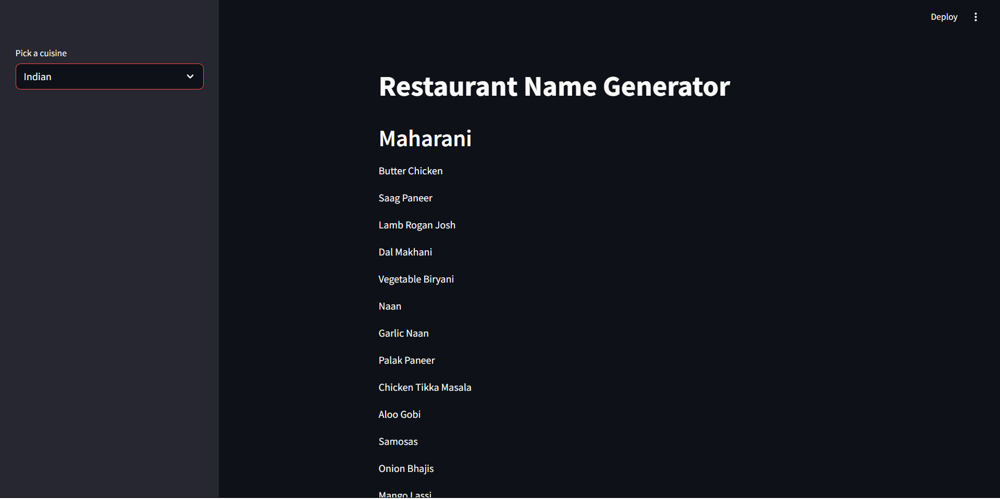

# 🍽️ Restaurant Name & Menu Generator

A simple AI-powered web app that generates a **restaurant name** and **menu items** based on your chosen cuisine using **Google Generative AI**, **LangChain**, and **Streamlit**.
---

---

## 🚀 Features

- 🎯 Choose from five cuisines:
  - Indian 🇮🇳
  - Mexican 🌮
  - Italian 🍝
  - American 🍔
  - Arabic 🥙
- 🧠 Uses a powerful LLM via LangChain to generate:
  - Creative restaurant names
  - Themed menu items
- 💻 Built with an interactive UI using Streamlit

---

## 🛠️ Tech Stack

- Google Generative AI
- LangChain
- Streamlit
- Python

---

## 🔑 API Key

You must create your own **Google Generative AI API Key** from Google AI Studio and add it to a `.env` file:

